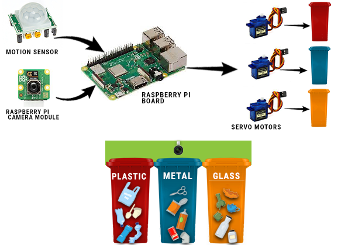
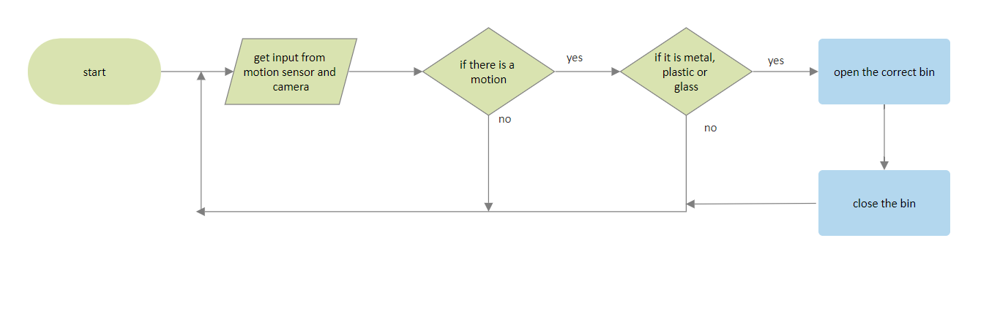
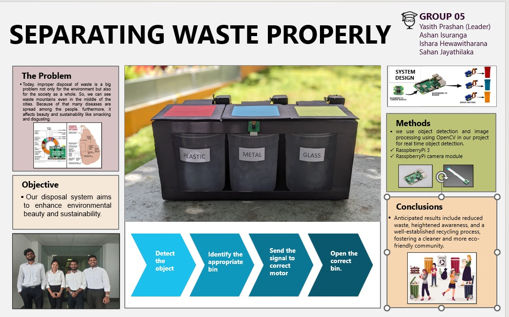

# ♻️ Smart Bin – Automated Waste Sorting System

An IoT-based smart waste management system that uses **computer vision (OpenCV)** and **Raspberry Pi** to automatically detect and sort waste into the correct bin.

---

## 🚀 Overview

Improper waste disposal leads to pollution, health risks, and low recycling rates.  
This project solves that problem by building an **automated waste sorting system** that:

- Detects waste using a camera  
- Classifies it using object detection  
- Opens the correct bin automatically using servo motors  

---

## 🎯 Key Features

- Real-time object detection using OpenCV  
- Automated bin selection (servo motor control)  
- Motion-triggered system (PIR sensor)  
- 80–85% classification accuracy (prototype)  
- End-to-end IoT system (hardware + software integration)  

---

## ⚙️ System Workflow

1. Motion sensor detects user  
2. Camera captures waste image  
3. Raspberry Pi processes image  
4. Object is classified  
5. Servo motor opens correct bin  

---

## 🛠️ Tech Stack

**Software**
- Python  
- OpenCV  
- TensorFlow / YOLO (tested)

**Hardware**
- Raspberry Pi  
- Camera Module  
- PIR Motion Sensor  
- Servo Motors  

---

## 📂 Project Structure
Object_Detection_Files/
├── coco.names
├── frozen_inference_graph.pb
├── object-ident.py
├── object-ident-2.py
├── object-ident-3.py
├── object-ident-4.py
├── Identification_code.txt
├── Identification_code_original.txt
├── opy.py
├── ssd_mobilenet_v3_large_coco_2020_01_14.pbtxt

---

## 🖼️ Conceptual Design

---

## 🖼️ Demo / Exhibition

---

## 📊 Results

- 80–85% detection accuracy  
- Reduced manual sorting effort  
- Real-time response system  

---

## ⚠️ Limitations

- Sensitive to lighting conditions  
- Limited dataset  
- Raspberry Pi performance constraints  

---

## 🔮 Future Improvements

- Improve accuracy using deep learning  
- Add cloud dashboard  
- Expand waste categories  
- Mobile/web monitoring system  

---

## 👥 Team

- Yasith Prashan (Leader)  
- Sahan Jayathilaka  
- Ashan Isuranga  
- Ishara Hewawitharana  

---

## 📌 Commit Message Guide

Use professional commit messages like:

- feat: add object detection using OpenCV  
- feat: integrate servo motor control  
- fix: improve detection accuracy  
- refactor: clean detection pipeline  
- docs: add README file  
- test: add classification tests  

---

## 📄 License

Academic project
